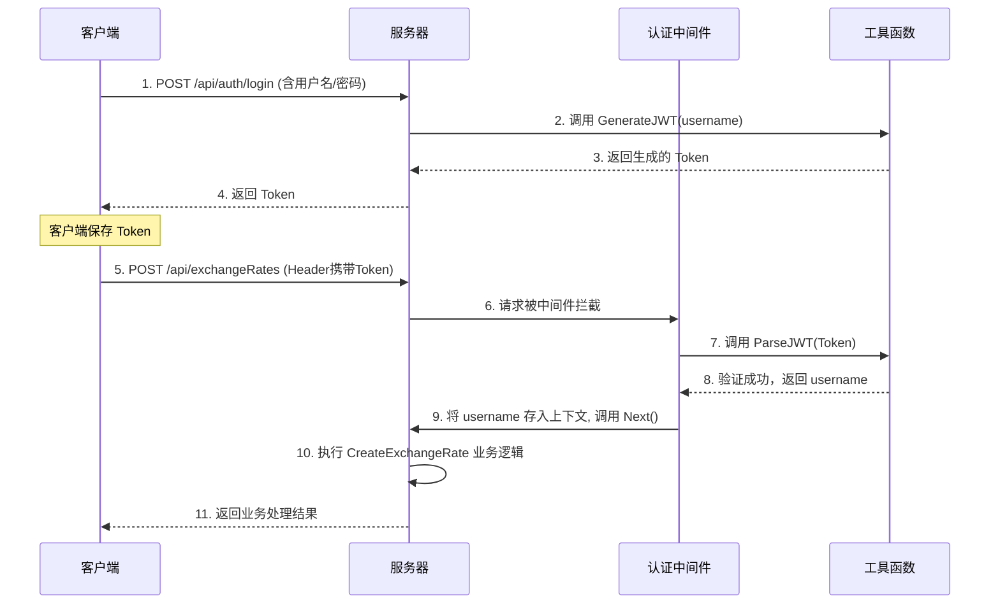

# Exchanging Rates Platform with Go

## **1. Basic Stuctures**


## **2. Some details about all parts**

### 1. JWT：身份认证与授权的核心

JWT (JSON Web Token) 是您项目中实现用户登录状态管理和 API 访问控制的基石。

#### 1.1 作用：颁发和验证“通行证”

-   **身份认证 (Authentication)**: 用户成功登录后，服务器会调用 [`utils.GenerateJWT()`](utils/utils.go:16) 函数，生成一个加密的 JWT（令牌），并将其返回给客户端。这个 JWT 就好比一张有时效性的“数字通行证”。
-   **授权 (Authorization)**: 客户端在后续访问受保护的 API 时（例如 `POST /api/exchangeRates`），必须在 HTTP 请求的 `Authorization` Header 中携带这张“通行证”。服务器端的 [`Authmiddleware`](middlewares/auth_middleware.go:10) 会拦截请求，并使用 [`utils.ParseJWT()`](utils/utils.go:32) 来验证这张通行证的真伪和有效性。只有验证通过，请求才会被放行。

#### 1.2 原理：三段式结构与签名

一个 JWT 由 `.` 分隔的三部分组成：`Header.Payload.Signature`。

-   **Header (头部)**: 记录了令牌类型 (`JWT`) 和签名算法 (如 `HS256`)。
-   **Payload (负载)**: 存放实际数据，在您的代码中是 `username` 和 `exp` (过期时间)。
-   **Signature (签名)**: 这是安全性的关键。它是通过将编码后的 Header、Payload 和一个**仅存于服务器的密钥 (Secret)** 进行加密运算得到的。这个签名可以保证：
    1.  **防伪**: 只有拥有密钥的服务器才能生成合法的签名。
    2.  **防篡改**: 如果 Payload 中的任何信息被修改，签名就会失效，验证将无法通过。

#### 1.3 核心函数

-   **`GenerateJWT(username string)`**:
    -   **位置**: [`utils/utils.go:16`](utils/utils.go:16)
    -   **功能**: 创建一个新的 JWT，将用户名和过期时间放入 Payload，然后用预设的密钥 (`"secret"`) 进行签名，生成最终的 Token 字符串。
-   **`ParseJWT(tokenString string)`**:
    -   **位置**: [`utils/utils.go:32`](utils/utils.go:32)
    -   **功能**: 解析客户端传来的 Token。它使用相同的密钥来验证签名是否正确、Token 是否过期。验证成功后，从 Payload 中提取出用户名并返回。

#### 1.4 整体流程图



---

### 2. `[]byte`：处理原始数据的字节切片

`[]byte` 是 Go 语言中的**字节切片**类型。在您的代码中，它主要出现在与加密和底层数据处理相关的函数中。

#### 2.1 为什么需要 `[]byte`？

许多底层库，特别是**加密库**（如 `bcrypt`, `jwt-go`）和进行**I/O操作**（文件读写、网络传输）的库，它们的设计是直接处理原始的字节流，而不是 Go 语言中经过抽象、不可变的 `string` 类型。

-   `string`: 更适合人类阅读和展示，是**不可变**的。
-   `[]byte`: 代表了机器处理的原始数据，是**可变**的。

#### 2.2 应用场景

在您的 [`utils/utils.go`](utils/utils.go) 文件中：

1.  **密码哈希**:
    ```go
    // utils/utils.go:12
    bcrypt.GenerateFromPassword([]byte(pwd), 12)
    ```
    `bcrypt` 库需要对密码的原始字节进行运算，因此必须将 `string` 类型的 `pwd` 转换为 `[]byte`。

2.  **JWT 签名与验证**:
    ```go
    // utils/utils.go:22
    token.SignedString([]byte("secret"))

    // utils/utils.go:40
    return []byte("secret"), nil
    ```
    JWT 的签名密钥 `"secret"` 本质上也是一串字节。签名和验证算法都需要以 `[]byte` 的形式来使用这个密钥。

**总结**: 当需要将数据交给底层库进行加密、解密或传输时，通常需要执行 `[]byte(yourString)` 这样的类型转换，以提供它们所需的原始数据格式。

---

### 3. `ctx.ShouldBindJSON()`：高效解析与绑定 JSON 数据

这是 Gin 框架中用于处理客户端请求的核心函数之一。

#### 3.1 作用：一行代码完成数据解析、绑定与校验

在您的 [`controllers/exchange_rate_controller.go:15`](controllers/exchange_rate_controller.go:15) 中：

```go
var exchangeRate models.ExchangeRate
if err := ctx.ShouldBindJSON(&exchangeRate); err != nil {
    // ... 错误处理
}
```

`ctx.ShouldBindJSON(&exchangeRate)` 自动完成了以下所有工作：

1.  **读取请求体**: 获取 HTTP 请求 Body 中的内容。
2.  **解析 JSON**: 将 Body 中的 JSON 字符串解析为 Go 的数据结构。
3.  **数据绑定**: 根据 `models.ExchangeRate` 结构体中定义的 `json:"..."` 标签，将解析出的 JSON 字段值，一一对应地填充到 `exchangeRate` 变量的相应字段中。
4.  **数据校验**: 如果结构体标签中包含校验规则（如 `binding:"required"`），它还会自动进行校验。
5.  **返回错误**: 如果上述任何步骤失败（如 JSON 格式错误、字段类型不匹配、校验失败），函数会返回一个 `error`，让你可以进行统一的错误处理，而不会让程序崩溃。

#### 3.2 优势：简化开发，提升健壮性

如果没有这个函数，您需要手动编写大量代码来完成同样的工作，过程繁琐且容易出错。`ShouldBindJSON` 将这一切简化为一行调用，极大地提升了开发效率和代码质量。

#### 3.3 与 `BindJSON` 的区别

-   `ShouldBindJSON`: 绑定失败时，**仅返回错误**，将错误处理的控制权交给开发者。**（推荐使用）**
-   `BindJSON`: 绑定失败时，会**自动向客户端发送 `400 Bad Request` 响应**并中断请求。